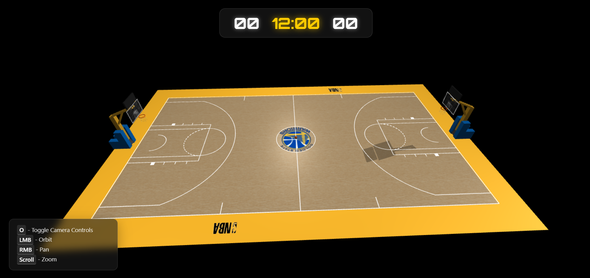
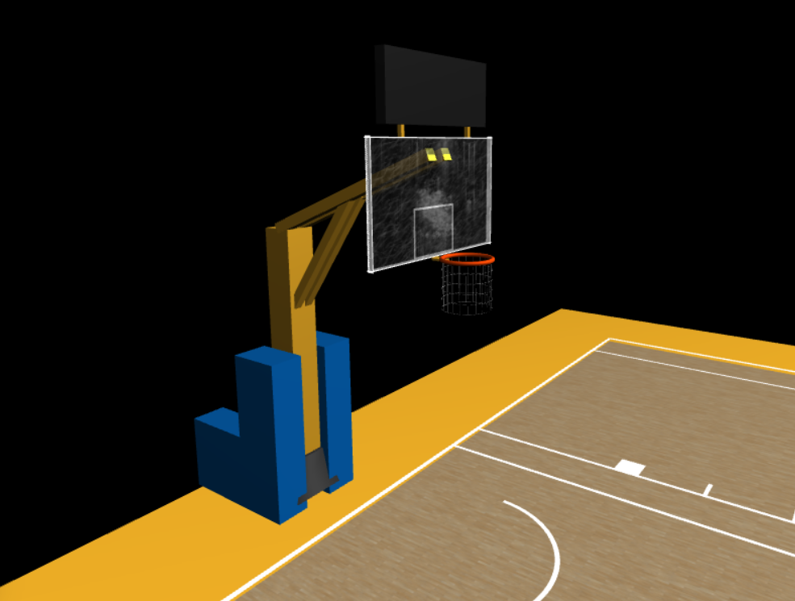
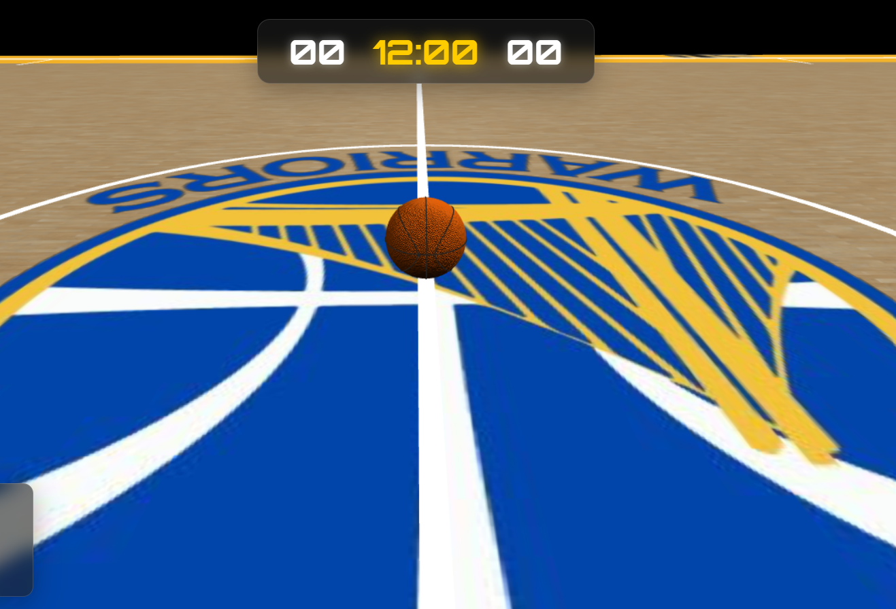
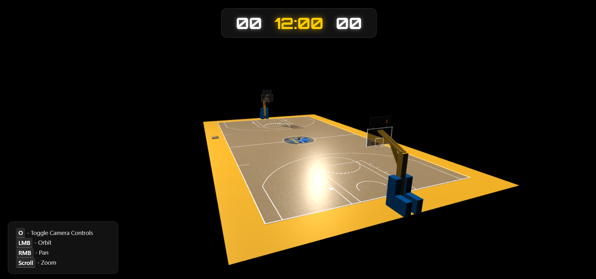
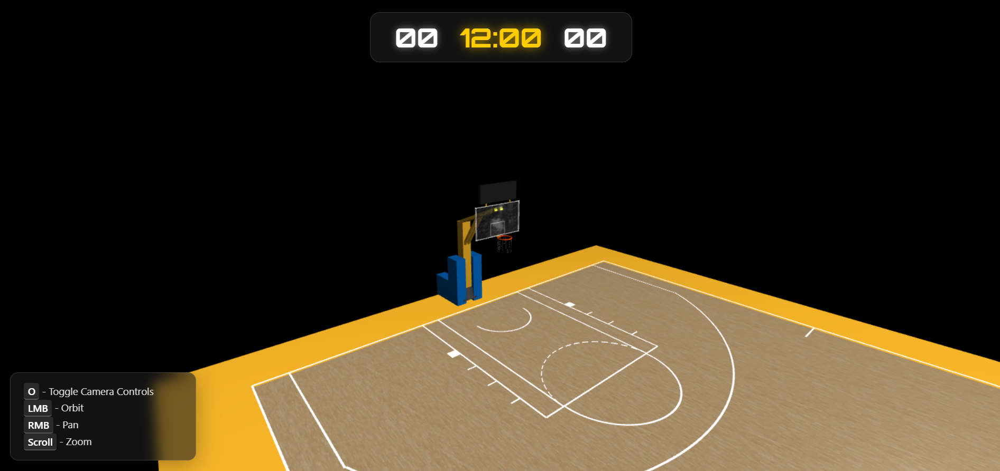

# Computer Graphics - Exercise 5 - WebGL Basketball Court

## Getting Started

1. Clone this repository to your local machine.
2. Make sure you have Node.js installed.
3. Start the local web server: `node index.js`
4. Open your browser and go to http://localhost:8000

## Complete Instructions

**All detailed instructions, requirements, and specifications can be found in:**
`basketball_exercise_instructions.html`

## Group Members

**MANDATORY: Add the full names of all group members here:**

- Itay Aharoni
- Nimrod Boazi

## Technical Details

- Run the server with: `node index.js`
- Access at http://localhost:8000 in your web browser

## Additional Features Implemented

- More detailed court markings:

  - Court styled in **Golden State Warriors** colors.
  - Court has authentic details: free throw lines, branding, Restricted area arc, Low block, and surrounding area.
  - Logo added at center ring.
  - Scoreboards designed and ready for future implementation.

- Textured surfaces for court and basketball: Basketball, Backboard, Court floor

- Enhanced lighting setup with multiple light sources:

  - Used directional light plus **3 extra pointlights** to mimic real court lighting.

- More detailed hoop models (chain nets, branded backboards):

  - chained net
  - Safety foams around the pole, like in real life.
  - added texture for realistic board look

- Stadium environment (bleachers, scoreboard)

  - Scoreboard above hoop
  - extra space eround the court for adding details

- Multiple camera preset positions:
  - main camera for viewing like youre watching on tv
  - Extra camera focused on the hoop for close-up viewing and extra angle — press **‘c’** to switch cameras.

## Known Issues / Limitations

- None at the moment.

## Sources of External Assets

- Used various **Three.js** features and functions.

## Screenshots

### 📷 Overall view of the basketball court with hoops

### 📷 Close-up view of basketball hoops with nets

### 📷 Basketball positioned at center court

### 📷 Camera controls demonstration

